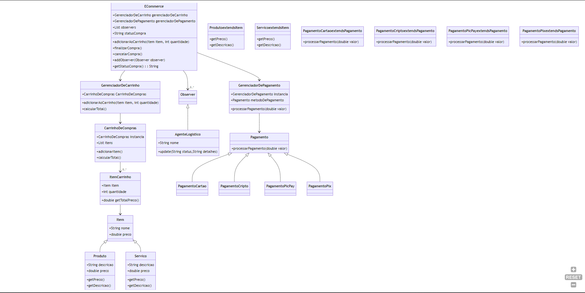

# Sistema de Comércio Eletrônico - Padrões de Projeto

Este projeto implementa um sistema de comércio eletrônico com foco em padrões de projeto. Abaixo estão os padrões utilizados em cada questão e as justificativas para sua adoção.

## Questão 1: Sistema de Pagamento

### Padrões Utilizados
- **Strategy**: Utilizado para implementar diferentes métodos de pagamento. Permite a fácil troca entre diferentes provedores de pagamento, aumentando a flexibilidade do sistema.
- **Singleton**: Pode ser aplicado ao `GerenciadorDePagamento` para garantir uma única instância, centralizando o gerenciamento dos pagamentos.
- **Polimorfismo(interfaces)**: Utilizado para permitir que diferentes métodos de pagamento sejam tratados de forma uniforme, facilitando a implementação de novos métodos de pagamento.
- **Single Responsibility Principle**: Utilizado para garantir que cada classe tenha uma única responsabilidade. Por exemplo, a classe `Pagamento` é responsável por armazenar os dados de um pagamento, enquanto a classe `GerenciadorDePagamento` é responsável por gerenciar os pagamentos.
## Questão 2: Carrinho de Compras

### Padrões Utilizados
- **Composite**: Utilizado na relação entre `CarrinhoDeCompras` e `ItemCarrinho`. Permite tratar coleções de itens de forma uniforme, facilitando operações como cálculo do total.
- **Singleton**: Aplicável ao `CarrinhoDeCompras` para garantir um único carrinho por sessão de usuário.
- **Single Responsibility Principle**: Utilizado para garantir que cada classe tenha uma única responsabilidade. Por exemplo, a classe `CarrinhoDeCompras` é responsável por armazenar os itens do carrinho, enquanto a classe `ItemCarrinho` é responsável por armazenar os dados de um item. Assim como tem o `GerenciadorDeCarrinho`, que é responsável por gerenciar os carrinhos de compras.
## Questão 3: Agente Logístico

### Padrões Utilizados
- **Observer**: Utilizado para notificar o `AgenteLogistico` sobre mudanças no estado da compra. Garante que o agente logístico seja informado sobre confirmações ou cancelamentos de compras.
- **Single Responsibility Principle**: Utilizado para garantir que cada classe tenha uma única responsabilidade. Por exemplo, a classe `AgenteLogistico` é responsável por gerenciar a logística da compra, enquanto a classe `Compra` é responsável por armazenar os dados da compra.

## Diagrama de Classes do Sistema

Caso queira visualizar pelo link clique [aqui](https://mermaid.live/view#pako:eNq1Vt1r2zAQ_1eMntzNCc5nE1MKpS2jsLFA9jTycpVUV2BLmSSXtFn-98mfkR0lYaX1gy3f5093pzttERaEogjhBJS6YxBLSFfcy5-C5N3fijSlElNvW9HN8_UblZRjBkTIO3oLUjL-LLzYRT2mtYAYUsp1R60hW3rfmdJXPx8VlS9UXnuiWilLZKmNs9hTGnSmDOS1BIsLhGEmOMgbUcPyHzRNPWZegce49v5kwDUjQOiFpfjEOCTsDWRp0rd5GDimiZMFhNRw_XrRwLYFY6qXFmT_wou8ciul0K78lKmooZvYFtKqlZJDLuMmHHlgO6HMd82VKzx5TDp7THBm9vhLaEhqTguUuxJOAzugfESqjkG1wd7EprLodxGbKDDchllVEBcptajZmoCmfqu8guqPUOPpmSpXWArI580TkT0m1FtLikUNtWVnIQXJzBmhG5Mz4rBrKmiRa_udsrqjCkuGQTiztjSVmAfgg83mZpw10GTQorVTeRgU463IZQtHOzhNC7F9raXAVCmQDduvLL5AIuRJQwa8hn1YPsGBZGv9mQ4WDC_g9VMdbD7e-pHJsD0_PFxNbs9NqRZEuKfKeZjOHlKdyHcdFrsTkJp5tB04nNfn9t3e_9-9dQPo9a7d_b4UPiHYiX9bcoXCfv_LCnn1qCyF3JMlVzgyPw4HTcu63ZxKhVa7ymUfmg51pNpyoc5e9syrv71et5WckSm6wWmZ8kCfk9nsd1TxyjLtkqsCKsnN1aRgdYYjCpBJUQqMmOthUW8rpJ-pGV8oMktCnyBL9Aqt-M6IgvG1fOUYRVpmNEDl3KwulG3iPWFaSBQ9QaIMkRa_P6praP4J0Br4byEaPfOLoi3aoGg4H_XDy9FoEk4n4Ww8Hk0D9Iqi3mV_OByGw9lsFk6ms_l4vgvQW2Fh0A8H48HlYDqYjafz8Wgy3P0DFvSDxQ)